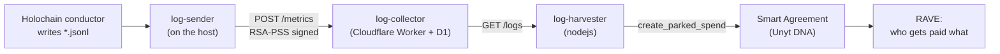

# Service Accounting with log-sender

This document explains how a measurement taken on a hosting machine becomes a
payment in Unyt, what each piece of the pipeline is responsible for, and what
you have to configure. It covers two audiences:

- **Hosting a hApp someone else has set up.** You fill in five or six values and
  run a container. [Jump to the standard flow](#standard-flow-hosting-a-happ).
- **Metering something of your own.** You write a Smart Agreement that defines
  what your proof of service means, and reuse the rest of the tooling as-is.
  [Jump to the extended example](#extended-example-your-own-proof-of-service).

For the operational detail of the log-sender binary itself — flags, systemd,
troubleshooting — see the [Log-Sender User Guide](./LOG_SENDER_USER_GUIDE.md).

## The pipeline in brief

Four programs, each with one job:



**log-sender** watches directories for `.jsonl` files, batches up the lines it
cares about, signs each batch with a device keypair, and posts them to a
collector. It never deletes a log file and it keeps a high-water mark
(`lastRecordTimestamp`) so a restart doesn't resend.

**log-collector** verifies the signature, stores each log line verbatim as a
`proof` row in D1, and stamps it with the Unyt agent key that the sending device
was registered under at that moment. It is a dumb, auditable store: it does not
interpret proofs.

**log-harvester** pulls a day's uninvoiced proofs, runs them through pluggable
summation classes, looks up which agreement the reporting agent's DNA is
registered against, and parks a spend on that agreement with the totals and the
raw per-host invoice payload. Then it marks the period invoiced.

**The Smart Agreement** is the only place a judgement is made. It prices the
work, decides who is allowed to be paid, and emits a RAVE — a Record of
Agreement Verifiably Executed — that every peer re-runs to validate.

### Where the trust actually lives

This is the part people usually want to know, so it is worth being blunt about
it.

The Unyt DNA does not validate proof of service. It has no opinion about what
counts as evidence of work. It runs the agreement's code and enforces
conservation of funds; everything about *what the proof means* lives in the
agreement, and the agreement was written by whoever created it.

That has a consequence worth stating plainly: **sender / collector / harvester
are a suggested pattern, not a requirement.** They exist because the pattern
happens to fit Holochain hosting well and because somebody had to write it.
Holo itself configures them differently for Wind Tunnel than for EdgeNode. If
your evidence is countersigned JSONL receipts rather than gossip counters, you
write an agreement whose `runtime_input_signature` accepts that shape and whose
Rhai prices it, and you can still use this tooling to move the receipts around.

Signatures in the pipeline, in order:

| Step | Signed by | Verified by |
|---|---|---|
| Gossip / op transfer | Both peers, at the Holochain network layer | Holochain |
| Log line | Not separately signed — it is the conductor's own record of what it received | — |
| Metrics batch | The device's RSA key, bound to a Unyt AgentPubKey at registration | log-collector (RSA-PSS) |
| Parked spend | The harvester's Holochain agent key | The Unyt DNA |
| RAVE | The executor, re-run and checked by every validator | Every peer |

So the "one-sided claim" reading is only true of the middle of the chain. The
gossip that `fetchedOps` records is already two-sided at the Holochain layer:
the op transfer happened between two peers who each have it on their own source
chain. What log-sender adds is a signed, timestamped, deduplicated transport of
that record to a place a harvester can read it. What the agreement adds is the
rule for turning it into money.

If you want stronger attestation than that — a receipt countersigned by the
party who received the service, say — nothing in the pipeline stops you. Put the
countersignature in the proof line and check it in your agreement's Rhai.

## Standard flow: hosting a hApp

You are running an Edge Node for a hApp whose economics someone else has already
set up. What you need from them, and what you supply yourself:

| Value | Where it goes | Who gives it to you |
|---|---|---|
| Log-collector URL | `LOG_SENDER_ENDPOINT` | The hApp's sponsor |
| Your Unyt AgentPubKey (`uhCAk…`) | `LOG_SENDER_UNYT_PUB_KEY` | You — this is the **payee**, the key that gets paid |
| Agreement hash (`uhCkk…`) | `economics.agreementHash` in the hApp config | The hApp's sponsor |
| Payor's Unyt AgentPubKey (`uhCAk…`) | `economics.payorUnytAgentPubKey` | The hApp's sponsor |
| Price sheet hash | `economics.priceSheetHash` | The hApp's sponsor (often blank — the price sheet is usually fixed inside the agreement at creation) |
| Report interval | `LOG_SENDER_REPORT_INTERVAL_SECONDS` (default 60) | You |
| Report directory | `LOG_SENDER_LOG_PATH` (default `/var/local/lib/holochain/reports/`) | Set by the image |

Two keys, two roles. `LOG_SENDER_UNYT_PUB_KEY` is *your* identity as a host —
the collector snapshots it onto every metric row you submit, and the harvester
aggregates by it. `payorUnytAgentPubKey` is the customer who funds the
agreement. You never hold the payor's key; it is in the config so the node's
tooling can validate it and so the record of who is meant to be paying is local.

Also note that you do not have to know the DNA hash. `install_happ` extracts it
after installation and calls `log-sender register-dna` with it, which is what
later lets the harvester look up which agreement your metrics belong to.

### The sequence

```bash
docker run --name unytnode -dit \
  -v $(pwd)/holo-data:/data \
  -p 4444:4444 \
  -e LOG_SENDER_ENDPOINT=https://log-collector.example.dev \
  -e LOG_SENDER_UNYT_PUB_KEY=uhCAk... \
  ghcr.io/holo-host/edgenode:latest-unyt
```

Then inside the container:

```bash
happ_config_file create --name my_app --economics   # writes my_app_config.json
# edit in happUrl, networkSeed, and the economics block
install_happ my_app_config.json
```

Because the config carries an `economics.agreementHash` and the `LOG_SENDER_*`
env vars are set, `install_happ` does four things without further prompting:

1. Downloads and installs the hApp.
2. Runs `log-sender init` — generates a 2048-bit RSA keypair and registers it
   with the collector, which returns a `droneId`. Skipped if
   `/etc/log-sender/config.json` already exists.
3. Runs `log-sender register-dna --dna-hash … --agreement-id …`.
4. Starts `log-sender service`.

Verify:

```bash
jq '.droneId' /etc/log-sender/config.json   # non-zero means registration took
pgrep -f "log-sender service"
tail -f /data/logs/log-sender.log
```

Registering a second hApp later needs only step 3, with that hApp's DNA hash and
agreement.

### What actually travels the wire

Each cycle log-sender does two things.

It walks the report directories, reads every `*.jsonl` file, and forwards lines
whose `t` (microsecond timestamp, as a string) is newer than the stored
high-water mark. **The current binary forwards only lines with `k` equal to
`fetchedOps`** — everything else in those directories is skipped. Batches are
capped at 100 lines.

It also generates its own db-size report from each path in
`conductorConfigPathList`: it reads `data_root_path` out of the conductor YAML,
sums the file sizes under `databases/dht` per space (folding `-wal` and `-shm`
into the base file), and emits a line per space:

```json
{"k":"dbSize","t":"<micros>","d":"<space>","b":"<total bytes>"}
```

Both go to `POST /metrics` as `proof` strings, verbatim. The `value` and
`registeredUnitIndex` fields on the wire are placeholders set to 0 — all the
meaning is in the proof string. The collector stores them in the `metrics`
table:

| Column | Meaning |
|---|---|
| `signing_pub_key`, `drone_pub_key` | The RSA device identity |
| `unyt_pub_key` | Snapshotted from `drone_registrations` at submission time, so re-registering under a new Unyt key never rewrites history |
| `proof` | The log line, unmodified |
| `metric_timestamp`, `received_at` | Submission time in ms |
| `verified` | 1 once the RSA-PSS signature checked out |
| `registered_unit_index`, `metric_value`, `tags` | Unused by this pipeline |

A `UNIQUE(drone_pub_key, registered_unit_index, metric_timestamp, proof)`
constraint makes re-submission idempotent.

Once a day the harvester asks for the previous UTC day's rows, feeds each proof
to its summation classes in order until one accepts it, and produces per-host
totals: `FetchedOpBytesPerDay` (sum of `b` across `fetchedOps` lines) and
`DbSizeByteDays` (mean of `b` across `dbSize` lines). It then posts
`/get-registered-dna` for that Unyt key to find the agreement, and calls
`create_parked_spend` on the `transactor` zome of the hApp's `alliance` role:

```jsonc
{
  "ea_id":   "<agreement action hash>",
  "ct_role_id": "log_harvester_spender",
  "amount":  { "1": "<gossip total>", "2": "<db size mean>" },
  "spender_payload": {
    "invoice_payloads": [
      { "host_pub_key": "uhCAk...", "logs": [ { "k": "AgentInfo", "g": "...", "s": "..." } ] }
    ]
  }
}
```

The `amount` unit indices and the `logs` keys are a contract between your
harvester and your agreement, not a fixed property of the system. The shipped
`holo_hosting_proof_of_service` template, for example, reads storage from unit
`2` / log key `s`, gossip from unit `3` / log key `g`, gets from `4` / `gt`, and
two Wind Tunnel placeholders from `5` and `6`. **Check this mapping against the
agreement you are actually pointing at** — a dimension that lands on the wrong
unit index prices silently and wrongly.

Finally the harvester posts `/mark-invoiced` for the period, so the next run
skips those rows.

## Extended example: your own proof of service

Say you host something that is not Holochain gossip — a relay, a media
transcoder, an archival service — and your evidence of work is a receipt
countersigned by the client. You want to invoice against that. The tooling below
the agreement is generic enough to carry it.

Here is what you change, and what you get to leave alone.

### 1. Decide the proof shape

One JSON object per unit of work, one per line, with `k` naming the kind and `t`
a microsecond timestamp string. Beyond those two fields the shape is yours. A
countersigned receipt might look like:

```json
{"k":"relayReceipt","t":"1758571617392359","bytes":"1048576","client":"uhCAk...","client_sig":"..."}
```

Write these to a `.jsonl` file in a directory log-sender watches, and rotate them
yourself. log-sender never deletes anything.

**One caveat before you go further.** The current `read_reports` in
[`src/reader.rs`](./src/reader.rs) drops every line whose `k` is not
`fetchedOps`. Emitting a new kind therefore means either widening that filter
(it is a handful of lines) or, as a stopgap, emitting under `k: "fetchedOps"`
with your own extra fields. The `k`-based dispatch on the harvester side is
already open — that end needs no patching.

### 2. Write the agreement

This is the substantive work, and it is where your proof-of-service methodology
actually lives. Start from
[`smart_agreement_library`](https://github.com/unytco/smart_agreement_library) —
copy `library/holo_hosting_proof_of_service/` to
`library/your_service_pos/` and work through its six files:

| File | What you change |
|---|---|
| `runtime_input_signature.json` | The JSON Schema for your proof. This is your first line of defence: a proof that doesn't match is rejected before your code runs. Pin numerics as pattern-matched strings, not JSON numbers. |
| `execution_code.rhai` | The pricing and verification logic. Verify the countersignature here, reject or ignore unsigned receipts, price the verified ones against your price sheet. |
| `output_signature.json` | The RAVE shape you emit — `unyt_allocation` entries of receiver plus a unit map of string amounts. |
| `agreement_definition_input.json` | The form a UI renders when someone instantiates your template. |
| `other_options.json` | `one_time_run`, `aggregate_execution` (you want `true` for periodic invoicing), tags, permissions. |
| `agreements/agreement_rules_1.json` | Roles, where each input comes from, and executor rules. |

The `holo_hosting_proof_of_service` template is worth reading in full before you
start, not because you need its logic but because its header comments spell out
the traps: default-deny allow lists, absent rates counting as zero, why unspent
funding is locked and carried forward rather than refunded, and why the
executor has to be a single named agent rather than `Any` when the agreement
holds a lock.

Constraints the engine enforces on your Rhai, all of which bite in practice:

- It must be deterministic. Every validating peer re-runs it and compares
  outputs.
- Amounts are strings in a unit map, never floats. Use the fuel helpers.
- Only registered helper functions are available. There is no I/O beyond the
  declared inputs and `get_data_blob`.
- Funds are conserved. You cannot allocate more than was parked.

The roles block is how you say who may do what. In the Holo template there are
three: `log_harvester_spender` (parks the invoices, and is the sole authorized
executor), `edge_node_customer_spender` (funds it and holds the allow list), and
`list_publisher` (the same customer, maintaining who may be paid). Yours might
be simpler — a spender and a receiver — or might add a role for the
counterparty who signs receipts.

### 3. Instantiate it

Creating a Smart Agreement from a template means supplying the placeholders the
example leaves open: which agent holds each role, what the executor rules are,
and any `Fixed` inputs such as the price sheet blob hash. In the Holo case the
customer creates the agreement, fixes the price sheet, and authorizes the
harvester as sole executor. The action hash you get back is the
`agreementHash` / `agreement_id` everything downstream refers to.

Price sheets are stored as a data blob and referenced by hash, so the rates are
pinned at creation and any change is a visible new agreement version rather than
a silent edit.

### 4. Point the pipeline at it

Register your DNA against the new agreement, exactly as the standard flow does:

```bash
log-sender register-dna \
  --config-file /etc/log-sender/config.json \
  --dna-hash "uhC0k..." \
  --agreement-id "uhCkk..." \
  --price-sheet-hash "uhCEk..."      # optional
```

That single call is what makes the harvester's `/get-registered-dna` lookup
return your agreement instead of the default one. Note that the harvester as
shipped refuses to proceed if a drone has more than one DNA registration — it
has no rule for choosing among them — so one agreement per drone unless you
extend that lookup.

### 5. Teach the harvester to sum your proofs

Implement `LogHarvesterSum` — four methods — and append it before or instead of
the built-in ones:

```typescript
export class SumRelayReceipts implements LogHarvesterSum {
  #map: { [key: string]: bigint } = {};

  unit(): string { return "RelayBytesPerDay"; }

  init(): void { this.#map = {}; }

  metric(unytPubKey: string, proof: string): boolean {
    const p = JSON.parse(proof);
    if (!p || p.k !== "relayReceipt" || typeof p.bytes !== "string") {
      return false;   // not mine — the next sum in the list gets a look
    }
    // fraud detection goes here: reject receipts whose client_sig
    // doesn't verify, whose client isn't a known counterparty, or
    // whose byte count is implausible for the period.
    this.#map[unytPubKey] = (this.#map[unytPubKey] ?? 0n) + BigInt(p.bytes);
    return true;
  }

  sum(summary: LogSummary): void {
    for (const key in this.#map) summary.setValue(key, this.unit(), this.#map[key]);
  }
}
```

Then in the harvester's `exec`: `harvester.appendSum(new SumRelayReceipts())`.

You will also need to adjust `LogSummary.getSummary()` in `src/types.ts`, which
currently hard-codes the two Holo units into fixed positions of the `amount`
map and the `logs` payload. That mapping is the harvester side of the contract
with your agreement's `runtime_input_signature`, so change both together.

Doing the signature check in the harvester rather than in the agreement is a
judgement call. The harvester is a single trusted party and its filtering is not
re-validated by peers; the agreement's is. Cheap sanity filters belong in the
harvester, and anything a counterparty would want to be able to prove belongs
in the Rhai.

### What you did not have to build

The device keypair and registration, signed and deduplicated transport, an
append-only store with per-metric attribution that survives key rotation, the
invoiced/uninvoiced bookkeeping, the daily cadence, and the Holochain client
plumbing to park a spend. Those are all proof-agnostic, and they are the part
that is tedious to get right.

## Reference

- [log-sender](https://github.com/unytco/log-sender) — [User Guide](./LOG_SENDER_USER_GUIDE.md), [E2E flow and testing](./E2E.md)
- [log-collector](https://github.com/unytco/log-collector) — [API docs](https://github.com/unytco/log-collector/blob/main/docs/api_documentation.md), [architecture](https://github.com/unytco/log-collector/blob/main/docs/architecture.md), `schema.sql`
- [log-harvester](https://github.com/unytco/log-harvester) — [Docker deployment](https://github.com/unytco/log-harvester/blob/main/DOCKER.md)
- [smart_agreement_library](https://github.com/unytco/smart_agreement_library) — [rules for writing an agreement](https://github.com/unytco/smart_agreement_library/blob/main/docs/smart_agreement_rules.md), [contributing](https://github.com/unytco/smart_agreement_library/blob/main/CONTRIBUTING.md)
- [Edge Node](https://github.com/Holo-Host/edgenode) — [log-sender quickstart](https://github.com/Holo-Host/edgenode/blob/main/docker/LOG_SENDER_QUICKSTART.md), [hApp config tool](https://github.com/Holo-Host/edgenode/blob/main/tools/happ_config_file/README.md)
- [`rave_engine` API docs](https://docs.rs/rave_engine) — helper functions and RAVE output types
- [unyt.co/docs](https://unyt.co/docs/)
